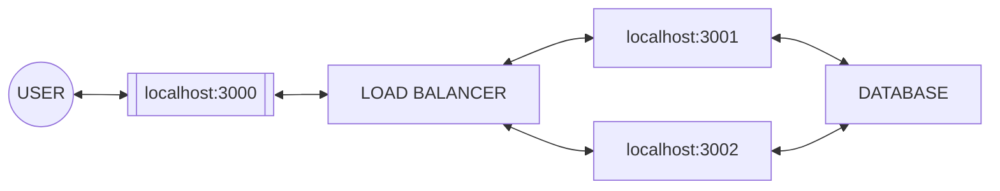

```mermaid
flowchart LR
    USER((USER)) <--> DNS
    DNS[[localhost:3000]] <--> LOADBALANCER
    LOADBALANCER[LOAD BALANCER] <--> POD1
    LOADBALANCER <--> POD2
    POD1[localhost:3001]
    POD2[localhost:3002]
    DATABASE[DATABASE]
    POD1 <--> DATABASE
    POD2 <--> DATABASE
```